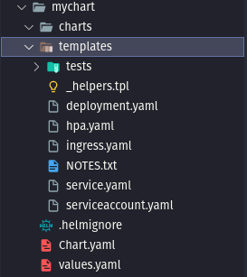

# Helm

## Introdução

- É um instalador, gerenciador e atualizador de pacotes para o kubernetes.

---

## Instalação

Segue abaixo o link de atualização:

[Helm | Installing Helm](https://helm.sh/docs/intro/install/)

---

## Manipulando Repositórios

Adicionar repositório

```bash
helm repo add stable https://charts.helm.sh/stable
```

Atualizar a lista do repositório

```bash
helm repo update
```

Verificar os repositórios

```bash
helm repo list
```

Remover repositório

```bash
helm repo remove <nome da repo>
```

---

## Instalando aplicações

Instalando o ingress-nginx

```bash
helm repo add ingress-nginx https://kubernetes.github.io/ingress-nginx
helm repo update

helm install <qualquer-nome> ingress-nginx/ingress-nginx
```

Pesquisando as repo do ingress

```bash
helm search repo ingress
```

Inspecionar tudo do repo do ingress-nginx/ingress-nginx

```bash
helm inspect all ingress-nginx/ingress-nginx
```

Enviando as configurações da repo ingress-nginx para dentro de arquivo yaml

```bash
helm inspect all ingress-nginx/ingress-nginx > value.yaml
```

Listando repo com namespace

```bash
helm list -n default
```

Colocando 2 replicas para o deployment dentro de um arquivo value.yaml

```yaml
controller:
  replicaCount: 2
```

Atualizando configuração com o helm

```yaml
helm upgrade meu-ingress-nginx ingress-nginx/ingress-nginx --namespace default --values value.yaml
```

Consultando revisões

```yaml
helm history meu-ingress-nginx -n default
```

Fazendo um rollback com helm

```bash
helm rollback meu-ingress-nginx -n default
```

Setando diretamente

```bash
helm upgrade meu-ingress-nginx ingress-nginx/ingress-nginx --namespace default --set controller.replicaCount=2
```

Fazendo rollback de uma determinada revisão

```bash
helm rollback meu-ingress-nginx 2 -n default
```

---

## Primeiro Helm Chart

Criar o template do helm chart

```bash
helm create <qualquer nome>

#ex
helm create mychart
```



Configurando a template

1. Apague tudo do values.yaml
2. E comece a adcionar templates em seus manifestos
    
    
    Tudo que estiver em seu manifesto estará no arquivo values.yaml
    
    ```yaml
    api:
      image: fabricioveronez/pedelogo-catalogo:v1.0.0
      serviceType: LoadBalancer
    
    mongodb:
      tag: 4.2.8
      credentials:
        userName: mongouser
        userPassword: mongopwd
      databaseName: admin
    ```
    
    ```yaml
    apiVersion: apps/v1
    kind: Deployment
    metadata:
      name: {{ .Release.Name }}-api-deployment
    spec:
      selector:
        matchLabels:
          app: {{ .Release.Name }}-api
      template:
        metadata:
          labels:
            app: {{ .Release.Name }}-api
        spec:
          containers:
          - name: api
            image: {{ .Values.api.image }}
            resources:
              requests:
                memory: "32Mi"
                cpu: "500m"
              limits:
                memory: "64Mi"
                cpu: "500m"
            ports:
            - containerPort: 80
            env:
              - name: Mongo__User
                value: {{ .Values.mongodb.credentials.userName }}
              - name: Mongo__Password
                value: {{ .Values.mongodb.credentials.userPassword }}
              - name: Mongo__Host
                value: {{ .Release.Name }}-mongo-service
              - name: Mongo__Database
                value:  {{ .Values.mongodb.databaseName }}
    ```
    
    **Explicando cada linha:**
    
    - `apiVersion: apps/v1`: Define a versão da API do Kubernetes que está sendo usada.
    - `kind: Deployment`: Define o tipo de recurso que está sendo criado, neste caso, um Deployment.
    - `metadata:`: Define metadados para o recurso.
        - `name: {{ .Release.Name }}-api-deployment`: Define o nome do Deployment. O valor é definido dinamicamente pelo Helm.
    - `spec:`: Define a especificação do recurso.
        - `selector:`: Define como o Deployment identifica os Pods que controla.
            - `matchLabels:`: Define os rótulos que os Pods devem ter para serem controlados por este Deployment.
                - `app: {{ .Release.Name }}-api`: Define o rótulo que os Pods devem ter.
        - `template:`: Define o modelo para os Pods que este Deployment controlará.
            - `metadata:`: Define metadados para os Pods.
                - `labels:`: Define rótulos para os Pods.
                    - `app: {{ .Release.Name }}-api`: Define um rótulo para os Pods.
            - `spec:`: Define a especificação para os Pods.
                - `containers:`: Define os contêineres que os Pods executarão.
                    - `name: api`: Define o nome do contêiner.
                    - `image: {{ .Values.api.image }}`: Define a imagem do contêiner. O valor é definido dinamicamente pelo Helm.
                    - `resources:`: Define os recursos que o contêiner solicitará e limitará.
                        - `requests:`: Define os recursos que o contêiner solicitará.
                            - `memory: "32Mi"`: Solicita 32Mi de memória.
                            - `cpu: "500m"`: Solicita 500 milicore de CPU.
                        - `limits:`: Define os limites de recursos para o contêiner.
                            - `memory: "64Mi"`: Limita a memória do contêiner a 64Mi.
                            - `cpu: "500m"`: Limita a CPU do contêiner a 500 milicore.
                    - `ports:`: Define as portas que o contêiner exporá.
                        - `containerPort: 80`: Expõe a porta 80 do contêiner.
                    - `env:`: Define as variáveis de ambiente para o contêiner.
                        - `name: Mongo__User`: Define a variável de ambiente `Mongo__User`. O valor é definido dinamicamente pelo Helm.
                        - `name: Mongo__Password`: Define a variável de ambiente `Mongo__Password`. O valor é definido dinamicamente pelo Helm.
                        - `name: Mongo__Host`: Define a variável de ambiente `Mongo__Host`. O valor é definido dinamicamente pelo Helm.
                        - `name: Mongo__Database`: Define a variável de ambiente `Mongo__Database`. O valor é definido dinamicamente pelo Helm.
    
    `.Release` é um objeto disponível em templates do Helm, uma ferramenta usada para gerenciar pacotes Kubernetes chamados charts. Este objeto contém informações sobre a release (lançamento) que está sendo manipulada pelo Helm no momento.
    
    Aqui estão alguns dos subcampos que você pode acessar a partir do objeto `.Release`:
    
    - `.Release.Name`: O nome da release. Este é um nome único que o Helm atribui à release.
    - `.Release.Namespace`: O namespace do Kubernetes onde a release está sendo instalada.
    - `.Release.IsUpgrade`: Este é um booleano que será verdadeiro se a release atual for uma atualização de uma release existente.
    - `.Release.IsInstall`: Este é um booleano que será verdadeiro se a release atual for uma instalação nova.
    - `.Release.Revision`: O número de revisão da release. Para uma nova instalação, a revisão é 1, e este número aumenta com cada upgrade da release.
    - `.Release.Service`: O serviço que está realizando a release. Normalmente, este é "Helm".
    
    No seu código, `.Release.Name` é usado para definir dinamicamente o nome do Deployment e o valor da variável de ambiente `Mongo__Host`.
    
    ```yaml
    apiVersion: v1
    kind: Service
    metadata:
      name: {{ .Release.Name }}-api-service
    spec:
      selector:
        app: {{ .Release.Name }}-api
      ports:
      - port: 80
        targetPort: 80
      type: {{ .Values.api.serviceType }}
    ```
    
    ```yaml
    apiVersion: apps/v1
    kind: Deployment
    metadata:
      name: {{ .Release.Name }}-mongodb-deployment
    spec:
      selector:
        matchLabels:
          app: {{ .Release.Name }}-mongodb
      template:
        metadata:
          labels:
            app: {{ .Release.Name }}-mongodb
        spec:
          containers:
          - name: mongodb
            image: mongo:{{ .Values.mongodb.tag }}
            ports:
            - containerPort: 27017
            resources:
              requests:
                memory: "1Gi"
                cpu: "1500m"
              limits:
                memory: "1Gi"
                cpu: "1500m"
            env:
              - name: MONGO_INITDB_ROOT_USERNAME
                value: {{ .Values.mongodb.credentials.userName }}
              - name: MONGO_INITDB_ROOT_PASSWORD
                value: {{ .Values.mongodb.credentials.userPassword }}
    ```
    
    ```yaml
    apiVersion: v1
    kind: Service
    metadata:
      name: {{ .Release.Name }}-mongo-service
    spec:
      selector:
        app: {{ .Release.Name }}-mongodb
      ports:
      - port: 27017
        targetPort: 27017
    ```
    
    Fazendo a instalação
    
    - Comando para fingir que executou com o —dry-run
        
        ```yaml
        helm install minhaapi api-produto --dry-run --debug
        
        # Jogando informações de debug para dentro de uma arquivo
        helm install minhaapi api-produto --dry-run --debug > teste.yaml
        
        ```
        
        - minhaapi → Nome da release. Pode ser qualquer nome
        
        Alterando o tipo do meu serviço
        
        ```yaml
        helm install minhaapi api-produto --set api.serviceType=ClusterIp --dry-run --debug > teste.yaml
        ```
        
    
    - Instalar os manifesto, enquanto ele espera
        
        ```yaml
        helm install minhaapi api-produto --wait
        ```
        

---

## Estrutura IfElse

Criando um secret e um configmap

```yaml
apiVersion: v1
kind: Secret
metadata:
  name: {{ .Release.Name }}-mongodb-secret
type: Opaque
data: #                                     Values                      | conver. base64 | converter para string  
    MONGO_INITDB_ROOT_USERNAME: {{ .Values.mongodb.credentials.userName | b64enc | quote }}
    MONGO_INITDB_ROOT_PASSWORD: {{ .Values.mongodb.credentials.userPassword | b64enc | quote }}
```

```yaml
apiVersion: v1
kind: ConfigMap
metadata:
  name: {{ .Release.Name }}-api-configmap
data:
    Mongo__Host: {{ .Release.Name }}-mongo-service
    Mongo_DataBase: {{ .Values.mongodb.databaseName }}
```

```yaml
apiVersion: apps/v1
kind: Deployment
metadata:
  name: {{ .Release.Name }}-mongodb-deployment
spec:
  selector:
    matchLabels:
      app: {{ .Release.Name }}-mongodb
  template:
    metadata:
      labels:
        app: {{ .Release.Name }}-mongodb
    spec:
      containers:
      - name: mongodb
        image: mongo:{{ .Values.mongodb.tag }}
        ports:
        - containerPort: 27017
        resources:
          requests:
            memory: "1Gi"
            cpu: "500m"
          limits:
            memory: "1Gi"
            cpu: "500m"
        ennFrom:
          {{- if empty .Values.mongodb.existSecret }}
          - secretRef:
              name: {{ .Release.Name }}-mongodb-secret
          {{- else }}
          - secretRef:
              name: {{ .Values.mongodb.existSecret }}
          {{- end }}
        # env:
        #   - name: MONGO_INITDB_ROOT_USERNAME
        #     value: {{ .Values.mongodb.credentials.userName }}
        #   - name: MONGO_INITDB_ROOT_PASSWORD
        #     value: {{ .Values.mongodb.credentials.userPassword }}
```

```yaml
apiVersion: apps/v1
kind: Deployment
metadata:
  name: {{ .Release.Name }}-api-deployment
spec:
  selector:
    matchLabels:
      app: {{ .Release.Name }}-api
  template:
    metadata:
      labels:
        app: {{ .Release.Name }}-api
    spec:
      containers:
      - name: api
        image: {{ .Values.api.image }}
        resources:
          requests:
            memory: "32Mi"
            cpu: "500m"
          limits:
            memory: "64Mi"
            cpu: "500m"
        ports:
        - containerPort: 80
        envFrom:
        - configMapRef:
            name: {{ .Release.Name }}-api-configmap
        env:
          - name: Mongo__User
            valueFrom:
              secretKeyRef:
                key: MONGO_INITDB_ROOT_USERNAME
                name: {{ .Release.Name }}-mongodb-secret
          - name: Mongo__Password
            valueFrom:
              secretKeyRef:
                key: MONGO_INITDB_ROOT_PASSWORD
                name: {{ .Release.Name }}-mongodb-secret
```

```yaml
{{- if empty  .Values.mongodb.existSecret -}}
apiVersion: v1
kind: Secret
metadata:
  name: {{ .Release.Name }}-mongodb-secret
type: Opaque
data: #                                     Values                      | conver. base64 | converter para string  
    MONGO_INITDB_ROOT_USERNAME: {{ .Values.mongodb.credentials.userName | b64enc | quote }}
    MONGO_INITDB_ROOT_PASSWORD: {{ .Values.mongodb.credentials.userPassword | b64enc | quote }}
{{- end -}}
```

---

## Estrutura Loop

**Dando um upgrade nos nossos templates Helm**

```yaml
helm upgrade minhaapi ./api-produto
```

**Criando um Ingress com um Loog (range)**

```yaml
apiVersion: networking.k8s.io/v1beta1
kind: Ingress
metadata:
  name: {{ .Release.Name }}-api-ingress
spec:
    rules:
    {{- range .Values.api.ingress  }}
    - host: {{ . }}
      http:
        paths:
        - backend:
            serviceName: {{ $.Release.Name }}-api-service
            servicePort: 80
    {{- end }}
```

Values

```yaml
api:
  image: fabricioveronez/pedelogo-catalogo
  serviceType: LoadBalancer
  ingress: ["simpleapi.com.br", "apiprodutos.com.br", "api.aulakubedev.com.br"]

mongodb:
  tag: 4.2.8
  #existSecret: nome do secret
  credentials:
    userName: mongouser
    userPassword: mongopwd
  databaseName: admin
```

Resultado:

```yaml
# Source: api-produto/templates/api-ingress.yaml
apiVersion: networking.k8s.io/v1
kind: Ingress
metadata:
  name: minhaapi-api-ingress
spec:
  ingressClassName: nginx
  rules:
  - host: simpleapi.com.br
    http:
      paths:
      - path: "/"
        pathType: Prefix
        backend:
          service:
            name: minhaapi-api-service
            port: 
              number: 80
  - host: apiprodutos.com.br
    http:
      paths:
      - path: "/"
        pathType: Prefix
        backend:
          service:
            name: minhaapi-api-service
            port: 
              number: 80
  - host: api.aulakubedev.com.br
    http:
      paths:
      - path: "/"
        pathType: Prefix
        backend:
          service:
            name: minhaapi-api-service
            port: 
              number: 80
```

---

## Named Template

Reaproveitar Templates e valores

Crie um arquivo tpl com o underscore na frente

```yaml
_helpers.tpl
```

Dentro dele você pode definir o seguinte template.

```yaml
{{- define "mongodb.serviceName"}}
{{ .Release.Name }}-mongo-service
{{- end }}
```

Como usar ele em uma amnifesto.

```yaml
apiVersion: v1
kind: ConfigMap
metadata:
  name: {{ .Release.Name }}-api-configmap
data:
    Mongo__Host: {{ template "mongodb.serviceName" . }}
    Mongo__Database: {{ .Values.mongodb.databaseName }}
```

```yaml
helm upgrade minhaapi /api-produto --dry-run --debug
```

```yaml
NAME: minhaapi
LAST DEPLOYED: Thu Jan 25 17:11:29 2024
NAMESPACE: default
STATUS: pending-upgrade
REVISION: 2
TEST SUITE: None
USER-SUPPLIED VALUES:
{}

COMPUTED VALUES:
api:
  image: fabricioveronez/pedelogo-catalogo
  ingress:
  - simpleapi.com.br
  - apiprodutos.com.br
  - api.aulakubedev.com.br
  serviceType: LoadBalancer
mongodb:
  credentials:
    userName: mongouser
    userPassword: mongopwd
  databaseName: admin
  tag: 4.2.8

HOOKS:
MANIFEST:
---
# Source: api-produto/templates/mongodb-secret.yaml
apiVersion: v1
kind: Secret
metadata:
  name: minhaapi-mongodb-secret
type: Opaque
data: #                                     Values                      | conver. base64 | converter para string  
    MONGO_INITDB_ROOT_USERNAME: "bW9uZ291c2Vy"
    MONGO_INITDB_ROOT_PASSWORD: "bW9uZ29wd2Q="
---
# Source: api-produto/templates/api-configmap.yaml
apiVersion: v1
kind: ConfigMap
metadata:
  name: minhaapi-api-configmap
data:
    Mongo__Host: minhaapi-mongo-service
    Mongo__Database: admin
---
# Source: api-produto/templates/api-service.yaml
apiVersion: v1
kind: Service
metadata:
  name: minhaapi-api-service
spec:
  selector:
    app: minhaapi-api
  ports:
  - port: 80
    targetPort: 80
  type: LoadBalancer
---
# Source: api-produto/templates/mongo-service.yaml
apiVersion: v1
kind: Service
metadata:
  name: minhaapi-mongo-service
spec:
  selector:
    app: minhaapi-mongodb
  ports:
  - port: 27017
    targetPort: 27017
---
# Source: api-produto/templates/api-deployment.yaml
apiVersion: apps/v1
kind: Deployment
metadata:
  name: minhaapi-api-deployment
spec:
  selector:
    matchLabels:
      app: minhaapi-api
  template:
    metadata:
      labels:
        app: minhaapi-api
    spec:
      containers:
      - name: api
        image: fabricioveronez/pedelogo-catalogo
        resources:
          requests:
            memory: "32Mi"
            cpu: "500m"
          limits:
            memory: "64Mi"
            cpu: "500m"
        ports:
        - containerPort: 80
        envFrom:
        - configMapRef:
            name: minhaapi-api-configmap
        env:
          - name: Mongo__User
            valueFrom:
              secretKeyRef:
                key: MONGO_INITDB_ROOT_USERNAME
                name: minhaapi-mongodb-secret
          - name: Mongo__Password
            valueFrom:
              secretKeyRef:
                key: MONGO_INITDB_ROOT_PASSWORD
                name: minhaapi-mongodb-secret
---
# Source: api-produto/templates/mongo-deployment.yaml
apiVersion: apps/v1
kind: Deployment
metadata:
  name: minhaapi-mongodb-deployment
spec:
  selector:
    matchLabels:
      app: minhaapi-mongodb
  template:
    metadata:
      labels:
        app: minhaapi-mongodb
    spec:
      containers:
      - name: mongodb
        image: mongo:4.2.8
        ports:
        - containerPort: 27017
        resources:
          requests:
            memory: "1Gi"
            cpu: "500m"
          limits:
            memory: "1Gi"
            cpu: "500m"
        ennFrom:
          - secretRef:
              name: minhaapi-mongodb-secret
        # env:
        #   - name: MONGO_INITDB_ROOT_USERNAME
        #     value: mongouser
        #   - name: MONGO_INITDB_ROOT_PASSWORD
        #     value: mongopwd
---
# Source: api-produto/templates/api-ingress.yaml
apiVersion: networking.k8s.io/v1
kind: Ingress
metadata:
  name: minhaapi-api-ingress
spec:
  ingressClassName: nginx
  rules:
  - host: simpleapi.com.br
    http:
      paths:
      - path: "/"
        pathType: Prefix
        backend:
          service:
            name: minhaapi-api-service
            port: 
              number: 80
  - host: apiprodutos.com.br
    http:
      paths:
      - path: "/"
        pathType: Prefix
        backend:
          service:
            name: minhaapi-api-service
            port: 
              number: 80
  - host: api.aulakubedev.com.br
    http:
      paths:
      - path: "/"
        pathType: Prefix
        backend:
          service:
            name: minhaapi-api-service
            port: 
              number: 80

NOTES:
Instalado
```

---

## Dependência de charts

Chart do mongodb

[](https://github.com/bitnami/charts/tree/main/bitnami/mongodb)

```yaml
apiVersion: v2
name: api-produto
description: A Helm chart for Kubernetes

# A chart can be either an 'application' or a 'library' chart.
#
# Application charts are a collection of templates that can be packaged into versioned archives
# to be deployed.
#
# Library charts provide useful utilities or functions for the chart developer. They're included as
# a dependency of application charts to inject those utilities and functions into the rendering
# pipeline. Library charts do not define any templates and therefore cannot be deployed.
type: application

# This is the chart version. This version number should be incremented each time you make changes
# to the chart and its templates, including the app version.
# Versions are expected to follow Semantic Versioning (https://semver.org/)
version: 0.1.0

# This is the version number of the application being deployed. This version number should be
# incremented each time you make changes to the application. Versions are not expected to
# follow Semantic Versioning. They should reflect the version the application is using.
# It is recommended to use it with quotes.
appVersion: "1.16.0"

dependencies:
  - name: mongodb
    version: "14.7.2"
    repository: "oci://registry-1.docker.io/bitnamicharts/mongodb"
```

```yaml
api:
  image: fabricioveronez/pedelogo-catalogo
  serviceType: LoadBalancer
  ingress: ["simpleapi.com.br", "apiprodutos.com.br", "api.aulakubedev.com.br"]

mongodb:
  auth:
    rootPassword: mongoRoot
    username: mongouser
    password: mongopwd
    database: produto
  persistence:
    enabled: true
```

```yaml
apiVersion: v1
kind: Secret
metadata:
  name: {{ .Release.Name }}-api-secret
data:
    Mongo__User: {{ .Values.mongodb.auth.username | b64enc | quote }}
    Mongo__Password: {{ .Values.mongodb.auth.password | b64enc | quote}}
```

```yaml
apiVersion: apps/v1
kind: Deployment
metadata:
  name: {{ template "api.apiName" . }}-deployment
spec:
  selector:
    matchLabels:
      app: {{ template "api.apiName" . }}
  template:
    metadata:
      labels:
        app: {{ template "api.apiName" . }}
    spec:
      containers:
      - name: api
        image: {{ .Values.api.image }}
        resources:
          requests:
            memory: "32Mi"
            cpu: "500m"
          limits:
            memory: "64Mi"
            cpu: "500m"
        ports:
        - containerPort: 80
        envFrom:
        - configMapRef:
            name: {{ template "api.apiName" . }}-configmap
        - secretRef:
            name: {{ template "api.apiName" . }}-secret
        # env:
        #   - name: Mongo__User
        #     valueFrom:
        #       secretKeyRef:
        #         key: MONGO_INITDB_ROOT_USERNAME
        #         {{- if empty .Values.mongodb.existSecret }}
        #         name: {{ .Release.Name }}-mongodb-secret
        #         {{- else }}
        #         name: {{ .Values.mongodb.existSecret }}
        #         {{- end }}
        #   - name: Mongo__Password
        #     valueFrom:
        #       secretKeyRef:
        #         key: MONGO_INITDB_ROOT_PASSWORD
        #         {{- if empty .Values.mongodb.existSecret }}
        #         name: {{ .Release.Name }}-mongodb-secret
        #         {{- else }}
        #         name: {{ .Values.mongodb.existSecret }}
        #         {{- end }}
```

```yaml
apiVersion: v1
kind: ConfigMap
metadata:
  name: {{ .Release.Name }}-api-configmap
data:
    Mongo__Host: {{ template "mongodb.serviceName" . }}
    Mongo__Database: {{ .Values.mongodb.auth.database }}
```

**Comando para buildar dependencias:**

```yaml
helm dependency build ./api-produto
```

Apos rodar o comando:


---

## Notes

Arquivo Notes

```yaml
A release {{ .Release.Name }} foi criada com sucesso.
```

```yaml
helm upgrade minhaapi ./api-produto

#saida
NOTES:
A release minhaapi foi criada com sucesso.
```